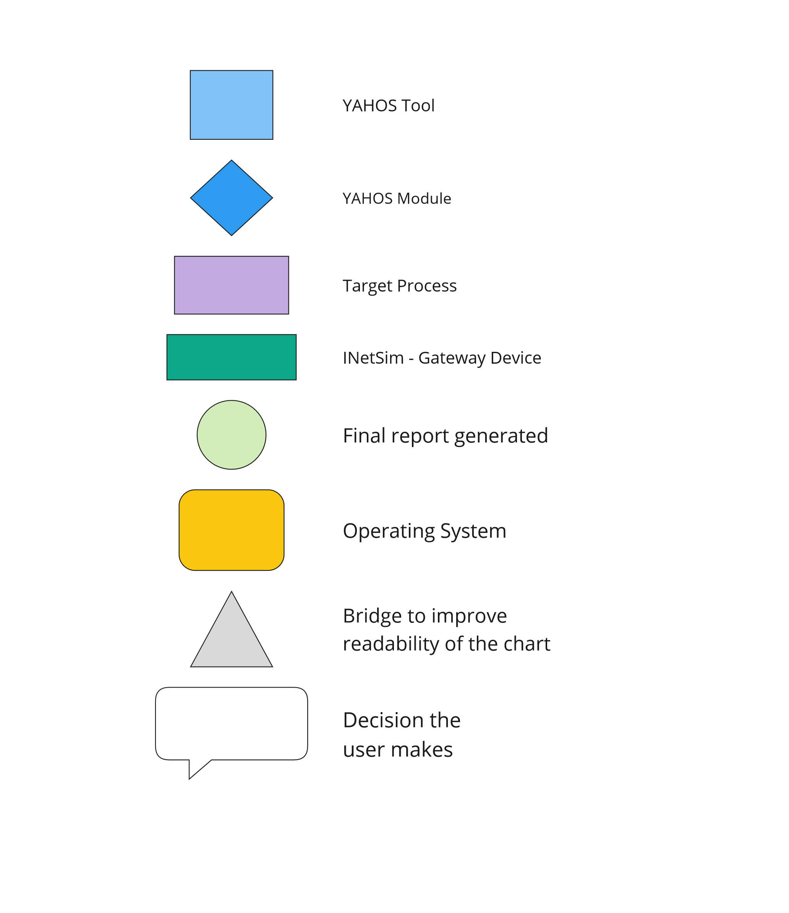
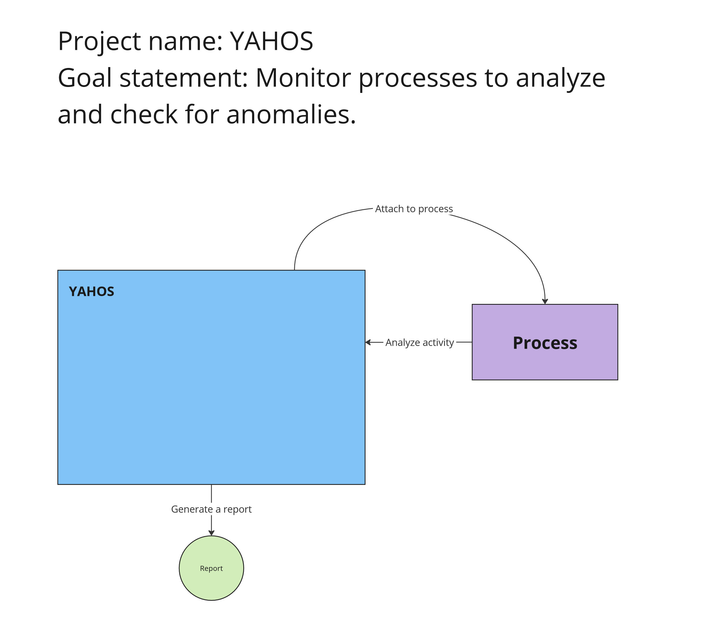
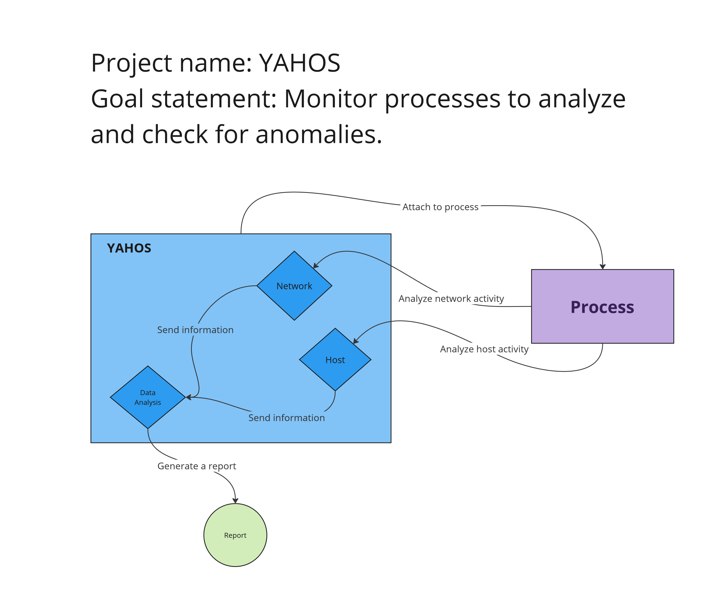
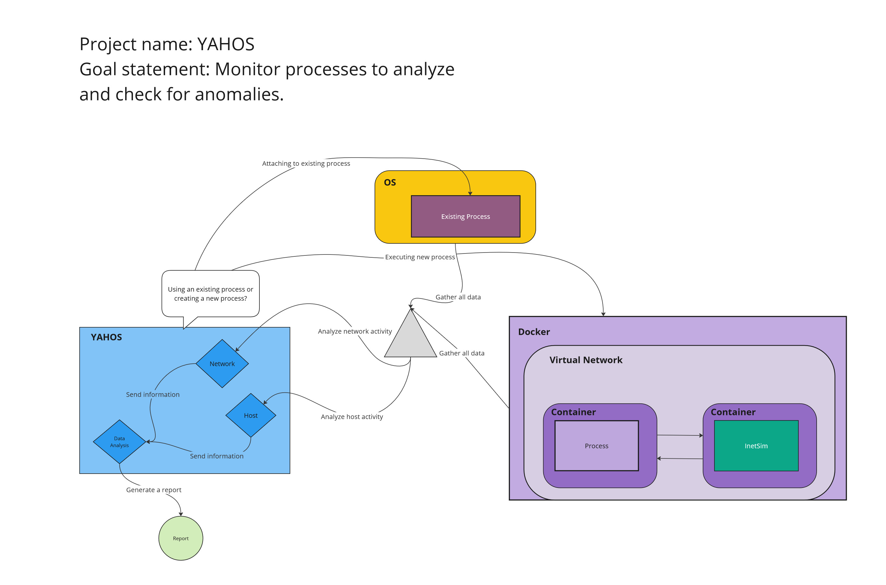

# Design Diagrams

The following diagrams abide by the conventions within this legend:

## Design D0

The `YAHOS` application will attach to a process and log its activity. This will generate a report in the form of logs and files.

## Design D1

The application will contain three modules that handle different types of activities captured from the target process. Firstly, a `Network` module that captures incoming and outgoing packets to a specific process based on ports. Secondly, `Host` module that monitors host signatures that the process generates, meaning file changes, read files, written files, etc. Thirdly, all data aggregated by the previous modules will end up in the `Data Analysis` module, which will formalize the data and save log files that will be served in the generated report.

## Design D2

The application will present a choice to the user of attaching to an existing process or starting a process. If a user wants to attach to a process, the application will query the OS and a list of processes will be display for selection. If the user wants to start a process, then a path must be provided to a binary file. If a valid path is provided, the application will provide an option to start an isolated environment. If selected, the application will then create a docker environment with a virtual network, a container for the running process, and a container for [INetSim](https://www.inetsim.org/) to act as a network gateway. In this environment, YAHOS will monitor the process activities and report as normal.